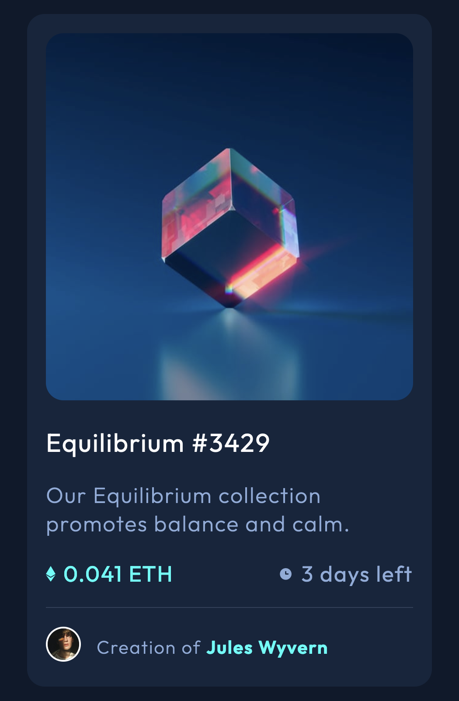

# Frontend Mentor - NFT preview card component solution

This is a solution to the [NFT preview card component challenge on Frontend Mentor](https://www.frontendmentor.io/challenges/nft-preview-card-component-SbdUL_w0U). Frontend Mentor challenges help you improve your coding skills by building realistic projects. 

## Table of contents

- [Frontend Mentor - NFT preview card component solution](#frontend-mentor---nft-preview-card-component-solution)
  - [Table of contents](#table-of-contents)
  - [Overview](#overview)
    - [The challenge](#the-challenge)
    - [Screenshot](#screenshot)
    - [Links](#links)
  - [My process](#my-process)
    - [Built with](#built-with)
    - [What I learned](#what-i-learned)
    - [Continued development](#continued-development)
  - [Author](#author)

## Overview

### The challenge

Users should be able to:

&#9745; View the optimal layout depending on their device's screen size

&#9745; See hover states for interactive elements

### Screenshot

### Links

- Live Site URL: [Netlify](https://jakegodsall-nft-preview-card.netlify.app/)

## My process

### Built with

- Semantic HTML5 markup
- CSS custom properties
- Flexbox
- Mobile-first workflow

### What I learned

The most difficult aspect of this challenge was layering over the overlay on the main image. I achieved this by using the `::after` pseudo-element on the parent container of the image. This is the first time I have used pseudo-elements.

### Continued development

I intend to improve the responsivity of this component so that is scales and is positioned correctly as the viewport changes.

## Author

- Website - [Jake Godsall](https://jakegodsall.com)
- Frontend Mentor - [@jakegodsall](https://www.frontendmentor.io/profile/jakegodsall)
- LinkedIn - [@godsalljake](https://www.linkedin.com/in/godsalljake/)

