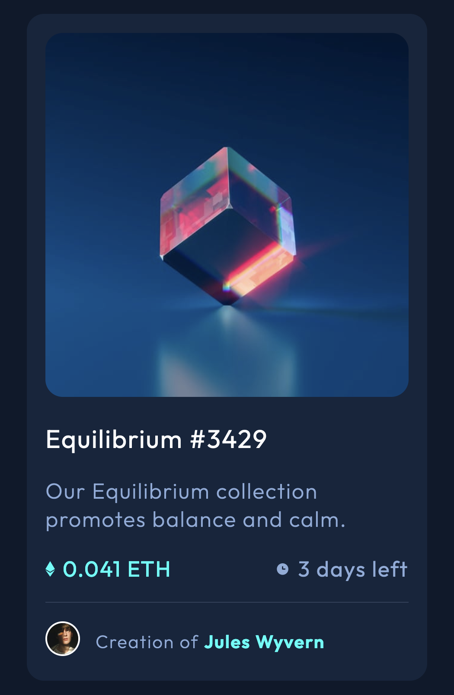

# Frontend Mentor - NFT preview card component solution

This is a solution to the [NFT preview card component challenge on Frontend Mentor](https://www.frontendmentor.io/challenges/nft-preview-card-component-SbdUL_w0U). Frontend Mentor challenges help you improve your coding skills by building realistic projects.

## Overview

### The challenge

Users should be able to:

&#9745; View the optimal layout depending on their device's screen size

&#9745; See hover states for interactive elements

### Screenshot

### Links

- Live Site URL: [Netlify](https://jakegodsall-nft-preview-card.netlify.app/)

## My process

### Built with

- Semantic HTML5 markup
- CSS custom properties
- Flexbox
- Mobile-first workflow

## Notes

This project was originally completed on 27th September 2022.

This repository is part of a series of repositories that have recently been cleaned and updated as part of an overhaul of my GitHub profile. The purpose of this overhaul was to ensure that each repository reflects my current development standards and practices, and to provide a cleaner, more professional appearance.

The project is updated as of 6th January 2024.

The recent enhancements to the project include:

- Created a node project with `lite-server`.
- Added the view icon to the main image when in the `hover` state.
- Moved to using relative units in CSS.
- Fixed the desktop layout.

## Author

- Website - [Jake Godsall](https://jakegodsall.com)
- Frontend Mentor - [@jakegodsall](https://www.frontendmentor.io/profile/jakegodsall)
- LinkedIn - [@godsalljake](https://www.linkedin.com/in/godsalljake/)
